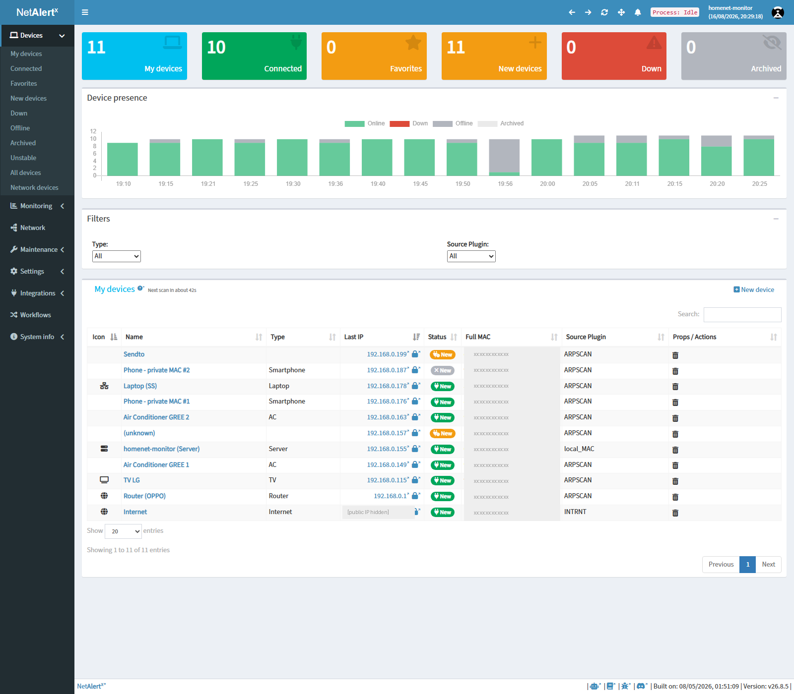
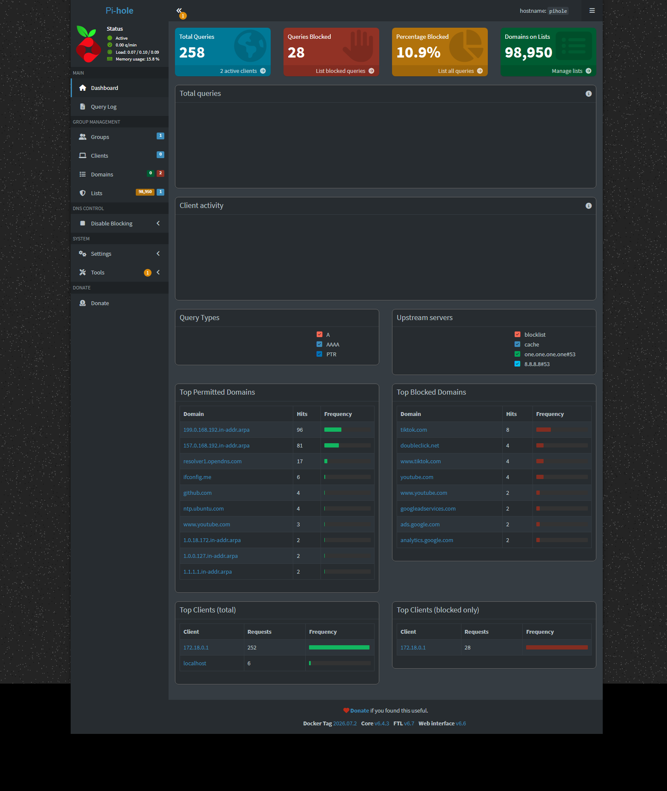
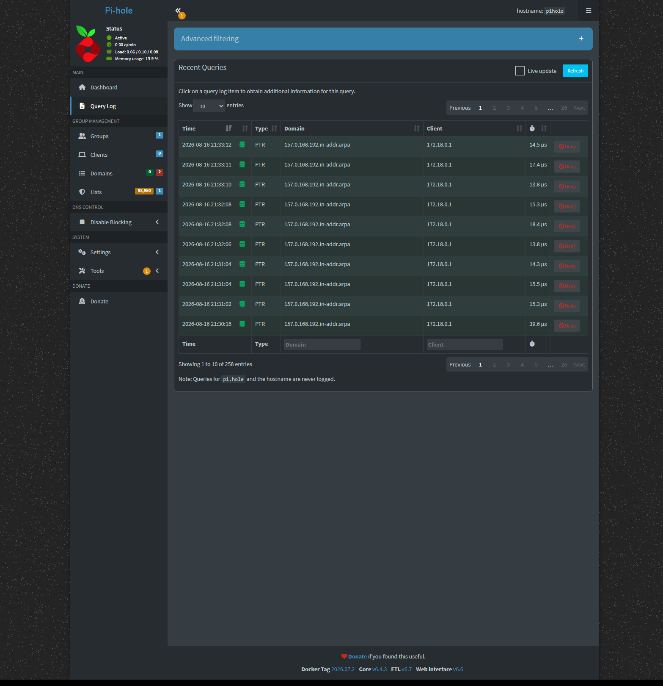
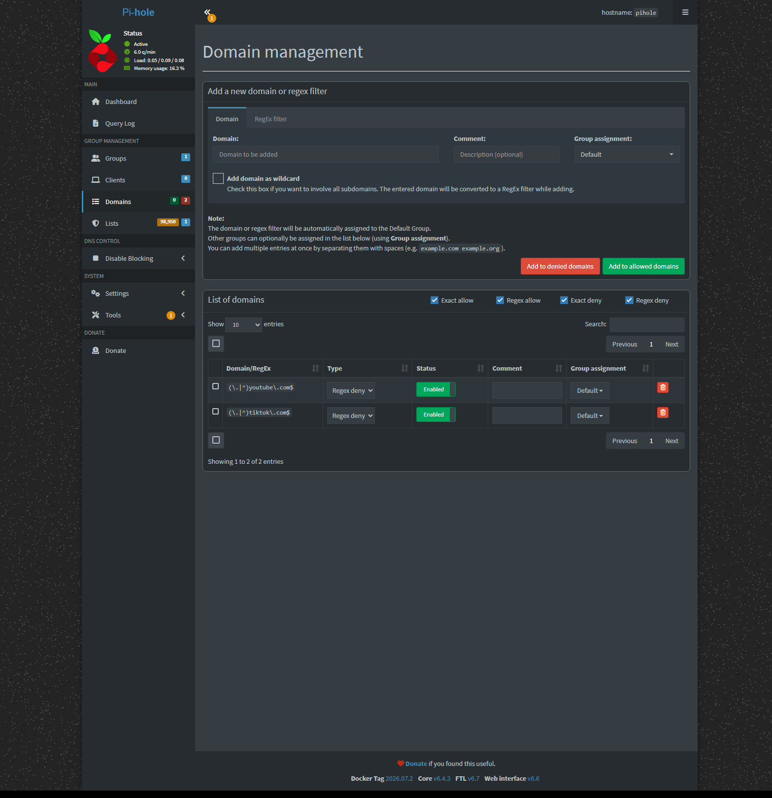

# Home Network Monitoring & DNS Filtering (NetAlertX + Pi-hole)

A self-hosted home network **visibility, intrusion-detection, and DNS-filtering** lab — built end-to-end on a Linux server using Docker, then validated against a live home network.

This project demonstrates practical **Blue Team / Network Security** skills: discovering every device on a network, alerting on unknown/new devices, routing all DNS through a filtering resolver, blocking ads/trackers and specific domains, and verifying the whole pipeline with packet captures.

> **Author:** Saeed Almalki — Senior IT Infrastructure Engineer → Cybersecurity
> 📍 Riyadh, Saudi Arabia

---

## What this project shows

- Deploying containerized network services with **Docker Compose** (host networking, Linux capabilities, `/data` persistence).
- **Network device discovery & inventory** with ARP scanning (NetAlertX): name, type, vendor, first-seen, online/offline, and **new-device alerts**.
- **Network-wide DNS filtering** with **Pi-hole**: ad/tracker blocklists, custom domain deny rules, per-client query logging.
- Correctly **freeing port 53** on Ubuntu (disabling the `systemd-resolved` stub listener) so a DNS server can bind it.
- Steering the whole LAN through the resolver via **router DHCP DNS**, and **verifying with `tcpdump`** that real devices resolve through it.
- Real-world **security lessons**: how client-side privacy features (Apple iCloud Private Relay) and browser **DoH** bypass network filters, and a Hyper-V host↔guest networking limitation.

---

## Architecture

```
                         Home LAN (192.168.0.0/24)
  ┌──────────┐   ┌──────────┐   ┌──────────┐   ┌──────────┐
  │ Phones   │   │ Smart TV │   │ Smart AC │   │ Laptops  │
  └────┬─────┘   └────┬─────┘   └────┬─────┘   └────┬─────┘
       │              │              │              │
       └──────────────┴──────┬───────┴──────────────┘
                             │  DHCP hands out DNS = server
                     ┌───────▼────────┐
                     │ Router (DHCP)  │  192.168.0.1
                     └───────┬────────┘
                             │
                 ┌───────────▼─────────────┐   Ubuntu Server 22.04 (Docker)
                 │        homenet-monitor  │   192.168.0.155
                 │  ┌───────────────────┐  │
   ARP scan ───► │  │ NetAlertX  :20211 │  │  device inventory + new-device alerts
                 │  └───────────────────┘  │
   DNS  :53 ───► │  ┌───────────────────┐  │  filtering resolver
                 │  │ Pi-hole   :53/:8080│  │  → upstream 1.1.1.1 / 8.8.8.8
                 │  └───────────────────┘  │
                 └─────────────────────────┘
```

- **Host:** Ubuntu Server 22.04.5 LTS on a Hyper-V VM (Generation 2, External virtual switch so it lives on the real home LAN). Designed to be portable to a **Raspberry Pi** for 24/7 always-on operation.
- **NetAlertX** runs in `network_mode: host` so it can ARP-scan the LAN directly.
- **Pi-hole** runs in bridge mode publishing `53/tcp+udp` (DNS) and `8080→80` (admin UI).

---

## Stack

Ubuntu Server · Docker Engine · Docker Compose · **NetAlertX** (ARP scan / device inventory) · **Pi-hole v6** (DNS sinkhole / blocklists) · `systemd-resolved` · `tcpdump` · Hyper-V · Azure/on-prem-style hybrid networking.

---

## Results (live home network)

| Metric | Value |
|---|---|
| Devices discovered & classified | **11** (router, smart TV, 2× smart AC, laptops, phones, server) |
| DNS queries observed | **258** |
| Queries blocked | **28 (10.9%)** |
| Blocklist domains loaded | **98,950** |
| Top blocked | `tiktok.com`, `doubleclick.net`, `youtube.com`, `googleadservices.com` |

Real home devices (e.g. GREE smart ACs) were confirmed resolving **through Pi-hole** via a live `tcpdump` capture:

```
192.168.0.149 > 192.168.0.155.53: A? infome.gree.com
192.168.0.163 > 192.168.0.155.53: A? infome.gree.com
```

### Evidence

| Screenshot | Shows |
|---|---|
|  | NetAlertX device inventory (MACs masked) |
|  | Pi-hole dashboard — queries, % blocked, top blocked domains |
|  | Pi-hole live query log |
|  | Custom domain deny rules |

---

## Build guide

1. [Overview & lab setup](docs/01-overview.md)
2. [Deploying NetAlertX & Pi-hole with Docker](docs/02-deployment.md)
3. [Routing the LAN through Pi-hole & verifying](docs/03-router-and-clients.md)
4. [Security lessons learned](docs/04-lessons-learned.md)

Compose files: [`compose/netalertx`](compose/netalertx/docker-compose.yml) · [`compose/pihole`](compose/pihole/docker-compose.yml)

---

## Security & privacy notes

- No secrets are committed. The Pi-hole admin password is provided via an environment variable — see [`.env.example`](.env.example). Real MAC addresses and the public WAN IP are masked in screenshots.
- This is a home lab. For production/always-on use, move it to dedicated hardware (Raspberry Pi), use SSH keys, and enable HTTPS on the admin UIs.

## Roadmap

- [x] Device discovery + new-device alerting (NetAlertX)
- [x] Network-wide DNS filtering + custom blocks (Pi-hole)
- [ ] Migrate to Raspberry Pi (24/7)
- [ ] Endpoint/host monitoring with **Wazuh** (logins, file integrity, vulnerabilities)

## License

MIT
